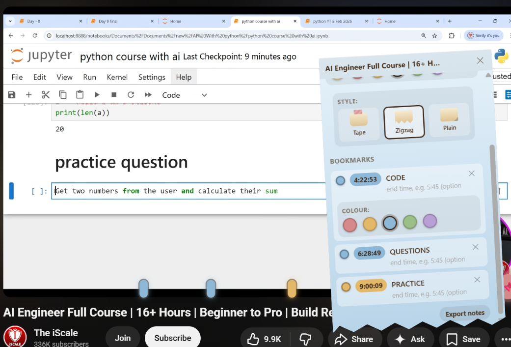
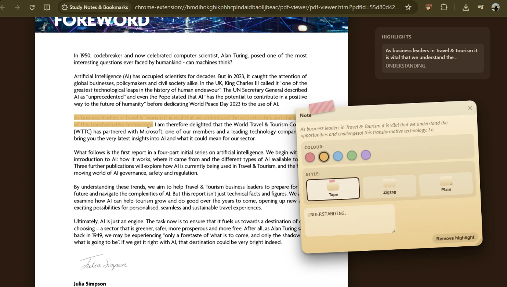
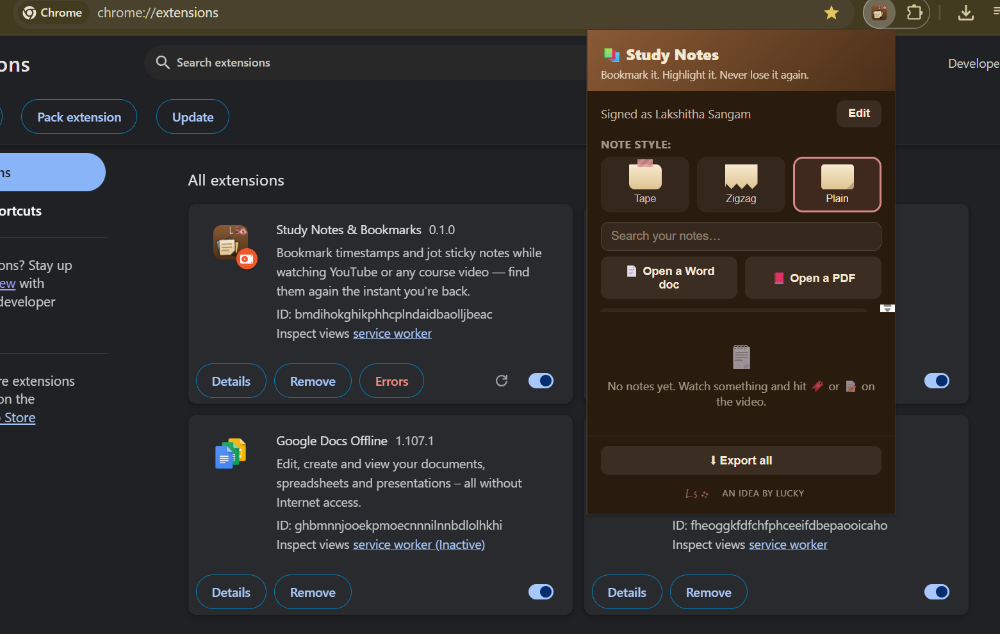

# Study Notes and Bookmarks


A Chrome extension that lets you bookmark moments, highlight text, and keep sticky notes on any video, article, Word document, or PDF, then find every one of them again the instant you come back to it. Everything lives on your own device. There is no account, no server, and nothing ever leaves your browser.

## Why this exists

Studying from video lectures, long articles, PDFs, and Word documents usually means one of two things happen. Either you pause every few minutes to jot something into a separate notes app and lose the connection between the note and the exact moment it came from, or you just keep watching, reading and quietly hope you remember the important bit later. This extension removes that tradeoff. A small floating pin follows you around every page, ready to drop a bookmark on a video timeline, wrap a sticky note around a highlighted sentence, or hold a running note for whatever you are looking at, all without leaving the page.

## Key features

**A universal pin, everywhere you go**
A small circular pin appears on every site you visit, the same way a writing assistant extension quietly follows you around. Drag it to whichever corner of the screen suits you and it remembers that position the next time you load the page.

**Timestamped video bookmarks**
On YouTube and other video sites, click the pin and choose 'Add bookmark', then click a point on the timeline to drop a marker exactly there. Give it an optional end time to mark a whole range instead of a single instant. Click any marker later and the video jumps straight to that point. Helps out exceptionally for students whose entire study schedule is wrapped around the digital world. Students can attach timestamped notes to each bookmark, making it easy to revisit key concepts later.



**A running note per video or page**
Every video or page gets its own sticky note for freeform thoughts. Notes save automatically as you type, no save button required.

**Highlight text on any page, PDF, or Word document**
Select any passage of text and a small toolbar appears letting you turn it into a highlight. A sticky note pops open right next to it allowing one to add context immediately. Click the highlighted text again later to reopen that same note.



**Color coding for bookmarks, highlights, and notes**
Choose from five accent colors for each bookmark and each highlight, and six for your running notes including the original parchment tone. New bookmarks and highlights automatically cycle through the palette so consecutive ones are never the same color by default, and you can always repick a color from the note itself.

**Three visual styles for your sticky notes**
Pick between a note with a small strip of tape and a folded corner, a note with a torn zigzag edge, or a plain note with just a folded corner. The choice applies everywhere, sticky notes appear and it is remembered across sessions.


**A built in Word document viewer**
Open a .docx file from the toolbar popup and it renders as clean, selectable text right inside a new tab, ready for the same highlight and the note workflow used everywhere else.

**A built in PDF viewer**
Open a PDF the same way. Pages render with a real, selectable text layer so you can highlight exact passages across a document of any length, not just annotate the page as a whole.

**Search, export, and manage everything from one popup**
Click the toolbar icon to see every video, page, document, and PDF you have ever taken notes on, search across all of them by title, open any one directly, export a single item or your entire collection to a plain Markdown file, or delete what you no longer need.



**Nothing leaves your device**
All notes, bookmarks, and highlights are stored locally using the browser's own storage. There is no account to create, no server this extension talks to, and no analytics. The only outbound action the extension ever takes is writing a file to your own Downloads folder when you choose to export.

## Getting started as a user

If you just want to install and use the extension without touching any source code, use the packaged copy in the release folder of this repository.

1. Download or clone this repository.
2. Open the release folder and unzip study notes extension package if you downloaded the zipped version, or simply note the folder path if you already have it unzipped.
3. Open a new tab in Chrome and go to chrome colon slash slash extensions.
4. Turn on Developer mode using the toggle in the top right corner.
5. Click Load unpacked and select the unzipped release folder.
6. A welcome tab opens automatically. Pin the extension to your toolbar for quick access using the puzzle piece icon in Chrome's toolbar.

That is the entire installation process. No build step, no dependencies to install, no command line required.

## Getting started as a developer

The extension is plain HTML, CSS, and JavaScript. There is no bundler, no framework, and no build step, so cloning the repository and loading it unpacked is all that is needed to start developing.

1. Clone this repository and check out the dev branch for the latest in progress work, or main for the last stable snapshot.
2. Open chrome colon slash slash extensions and turn on Developer mode.
3. Click Load unpacked and select the study notes extension folder at the root of the repository.
4. After editing any file, return to chrome colon slash slash extensions and click the small reload icon on the extension's card. Content script changes also require a hard refresh of any page you are testing on, since a page keeps running whichever version of the script was injected when it first loaded.

## How everything fits together technically

**Manifest V3 architecture**
The extension declares two content script blocks in manifest.json, one scoped to YouTube watch pages and one covering every other URL, so the video bookmarking experience and the universal highlighting experience can each use logic suited to that context. A single background service worker handles file downloads for exports, since that API is unavailable directly inside a content script.

**A shared highlighting engine**
The text highlighting logic used inside content scripts, the Word document viewer, and the PDF viewer all call into one shared module, lib slash highlighter dot js. It converts a browser text selection into stable character offsets, wraps the selected text in mark elements, and rebuilds that same range later by walking the page's text nodes and counting characters back to those offsets. If the page's underlying text has shifted since the highlight was created, for example because a dynamic site rerendered its content, the reconstructed text is checked against what was originally highlighted before anything is wrapped, so a stale highlight is skipped rather than incorrectly coloring the wrong span of text.

**Local storage schema**
Every bookmarked video, annotated page, opened document, and opened PDF is stored as one record in chrome dot storage dot local, keyed by a stable identifier such as the YouTube video id or a hash of a document's bytes. A lightweight index tracks which keys exist so the popup can list everything without loading full record contents. File bytes for documents and PDFs are kept in a separate storage entry from the note metadata, so simply listing your notes in the popup stays fast even if you have imported large files.

**Vendored libraries, no network calls at runtime**
Mammoth dot js handles converting Word documents into clean HTML, and PDF dot js handles rendering PDF pages and extracting a selectable text layer. Both are bundled directly inside the lib folder rather than fetched from a content delivery network, which keeps the extension fully self contained and compliant with Manifest V3's restrictions on remotely loaded code.

**No canvas dependency for the toolbar icon**
The extension's toolbar icon is generated by a small Node script, scripts slash generate icons dot js, that writes valid PNG files byte by byte using nothing but Node's built in zlib module. This avoids pulling in an image rendering library just to produce three small icon sizes.

## Project structure

```
study-notes-extension/
  manifest.json          extension configuration and permissions
  background.js           service worker, mainly handles exporting files
  content/                 content scripts injected into web pages
  lib/                     shared modules: storage, export, highlighting, vendored libraries
  popup/                   the toolbar popup UI
  welcome/                 the onboarding page shown after install
  viewer/                  the Word document viewer page
  pdf-viewer/               the PDF viewer page
  icons/                   generated toolbar icon assets
  scripts/                 development tooling, not needed at runtime
  release/                 a packaged, ready to load copy for end users
```

## Privacy

This extension requests broad host permissions because the floating pin and highlighting tools are designed to work on any site you choose to use them on, not just a preapproved list. Nothing about your browsing is read, recorded, or transmitted anywhere. The extension only acts on a page at all once you interact with the pin, and everything it stores stays inside your own browser's local storage until you export it yourself.

## Making changes after this is published

Cloning this repository or downloading the release folder gives you a snapshot of the code at that point in time. If you keep working on the project afterward, your local changes will not appear on GitHub automatically. You need to commit and push again for the repository to reflect anything new, the same as any other Git project.

## License

No license has been chosen yet. Until one is added, the default of full copyright applies, meaning others may view this code but should not assume they can reuse or redistribute it. Adding a permissive license such as MIT is worth considering if the goal is for other developers to freely learn from or build on this project.
